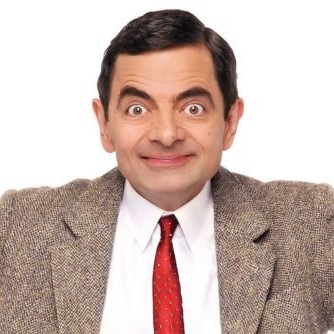
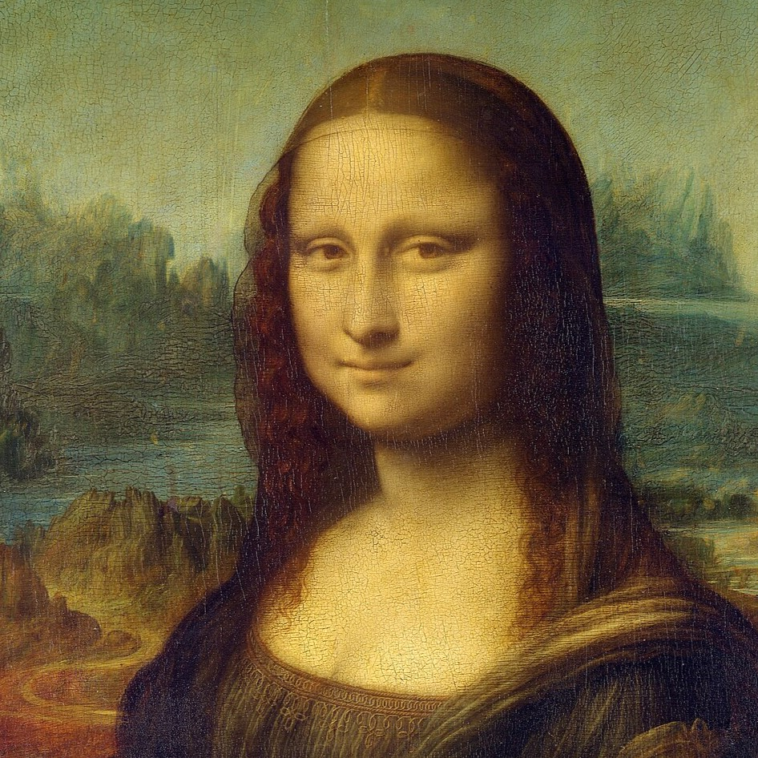
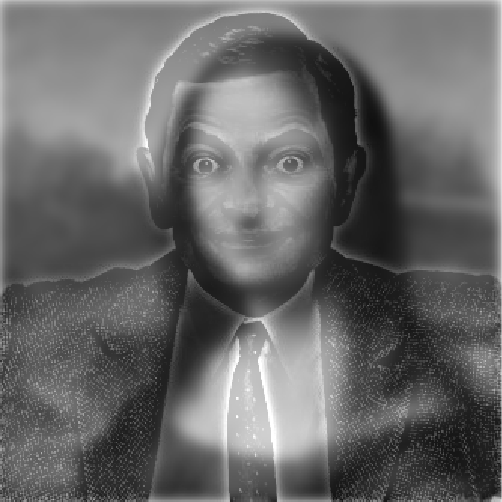
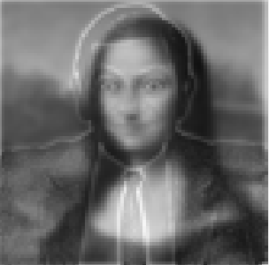

# Hybrid Image Generator

This MATLAB project generates hybrid images by combining the low-frequency components of one image with the high-frequency components of another. The resulting images create an optical illusion where the combined image appears differently at various distances.

## Table of Contents

- [Introduction](#introduction)
- [Requirements](#requirements)
- [Installation](#installation)
- [Usage](#usage)
- [Examples](#examples)
- [Contributing](#contributing)

## Introduction

Hybrid images are created by combining the low-frequency (blurred) component of one image with the high-frequency (detailed) component of another image. This project allows you to create such images and visualize them at different scales to observe the hybrid effect.

## Requirements

- MATLAB R2016b or later

## Installation

1. Clone the repository to your local machine:
    ```sh
    git clone https://github.com/kamalipurnet/Hybrid-Image-Generator.git
    ```

2. Navigate to the project directory:
    ```sh
    cd Hybrid-Image-Generator
    ```

## Usage

1. Place your input images in the project directory.
2. Update the image file paths in `Hybrid_Image_Generator.m`:
    ```matlab
    image1 = imread('Mona_Lisa.jpg');
    image2 = imread('mrb.jpg');
    ```
3. Run the MATLAB script:
    ```sh
    matlab -r "run('Hybrid_Image_Generator.m');"
    ```

## Examples

Here are examples of how to use the script and what the output will look like:

### Original Images

<p align="center">
  
  
</p>


### Hybrid Image

<p align="center">
  
  
</p>


## Contributing

Contributions are welcome! Please open an issue or submit a pull request if you have any improvements or new features to add.

